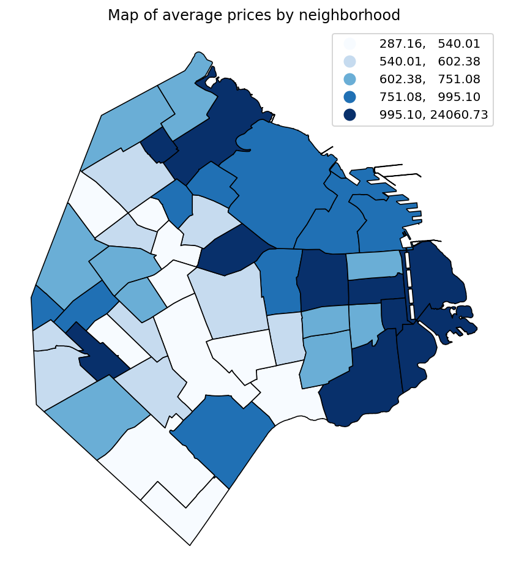

# Hedonic Pricing Model for Short-Term Rentals in Buenos Aires



*(Caption: Neighborhood-level heat map illustrating the spatial distribution of short-term rental prices in the Autonomous City of Buenos Aires)*

## 📊 Executive Summary (Business Value)

Location is one of the biggest drivers of what a property is worth. This project builds a **hedonic pricing model** (a regression that breaks a price down into the value the market assigns to each attribute) for short-term rentals in the Autonomous City of Buenos Aires (CABA). It measures how much factors such as neighborhood safety and local income are worth in the price of a rental.

**What this project demonstrates:**
* **Building a dataset from scratch:** Built, cleaned, and consolidated a custom panel dataset with over **145,000 observations**, merging disparate public data sources.
* **Pricing models for real estate:** A spatial hedonic model that isolates the effect of each location attribute on price, an approach widely used in real estate valuation.
* **Automated, reproducible workflow:** The full analysis runs from a single master script, in both Python and Stata.
* **Example of a finding:** A **1% increase in local crime is associated with a 0.062% drop in short-term rental prices**.

**Business application:** Real estate valuation and dynamic pricing for rental platforms and property managers, wherever geospatial factors need to be built into the price.

## 🧠 Dataset & Methodology

Because short-term rental prices reflect the willingness to pay for temporary housing in a specific location, the data inherently captures the premium or penalty associated with local neighborhood attributes, including perceived security.

To facilitate transparency and reproducibility, I independently built the dataset by scraping, cleaning, and integrating:
* Short-term rental data from **Inside Airbnb**.
* Official crime records, geographic features, and socioeconomic indicators (e.g., average family income) from the **Buenos Aires City Government Open Data Portal**.

*Access the clean, public dataset hosted on Kaggle for automated retrieval:* [marcodiazzz/buenos-aires-rentals-and-crime](https://www.kaggle.com/datasets/marcodiazzz/buenos-aires-rentals-and-crime)

## 🐍 Python Workflow (Fully Automated)

The Python pipeline is completely automated, handling data downloading, processing, and output generation entirely in memory or via console prints.

### 1. Requirements

Navigate to the Python directory and install the required dependencies:

```bash
cd Python
pip install -r requirements.txt
```

### 2. Execution

Run the master script. This will handle the data setup and sequentially call the required modules (`hedonic_crime_model_1.py` and `hedonic_crime_model_2.py`).

```bash
python Master.py
```

## 📈 Stata Workflow

Unlike the Python pipeline, the Stata workflow requires a manual download of the database and setting up a local working directory.

### 1. Dependencies

The code relies on the following external Stata packages: `geodist`, `spmap`, and `outreg2`.

Installation: The installation commands are included at the very beginning of the `Master.do` file, currently commented out with an asterisk (`*`). If you need to install them, simply remove the `*` and run those lines before proceeding.

### 2. Data Setup

1. Download the required database from [Kaggle](https://www.kaggle.com/datasets/marcodiazzz/buenos-aires-rentals-and-crime).
2. Place the downloaded database directly inside the `Stata/` folder, alongside the `.do` files.
3. Open `Master.do`. At the top of the file, locate the designated path variable and replace it with your local absolute path to the `Stata/` directory. This only needs to be configured once.

### 3. Execution

Run the master script. It will load the database, generate the necessary output directories, and sequentially call `hedonic_crime_model_1.do` and `hedonic_crime_model_2.do`.

```stata
do Master.do
```
